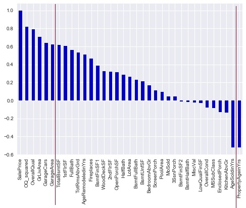

For the second project at the Metis DataScience Bootcamp, we had to use regression to predict something.  Since most US households have a significant portion of their net worth invested in 
their homes, I wanted to explore this aspect as part of my project.

# QUESTIONS: #
With my project I wanted to explore the answer to the following two questions:

1. *Financial:*  Can housing prices be forecast using historical sales data?
2. *Technical:*  Do linear regression models perform better with a larger or smaller number of attributes?

# PLAN: #
My plan for the project was the following:
1. Get the zip code from the user for the property whose price I am trying to forecast, and 5 neighboring zip codes.
2. Scrape house sales data from Trulia for these zip codes for the last 9 months
3. Create a regression model to predict pricing based on the various attributes of a house
4. Tune the model to minimize prediction error

# RESULTS: The Kitchen Sink model

<table>
  <thead>
    <tr>
      <th>Model Type</th>
      <th>Characteristics</th>
      <th>Trustworthiness</th>
    </tr>
  </thead>
  <tbody>
    <tr>
      <td>The 'Kitchen Sink' model</td>
      <td>Factors: 219</td>
      <td>Prediction error (RMSE): $24,362</td>
    </tr>
    <tr>
      <td></td>
      <td>Explanatory Power (R2): 90%</td>
      <td>Reality Check (Adj. R2): -5.4%</td>
    </tr>
  </tbody>
</table>

Model Type | Characteristics | Trustworthiness
-----------|-----------------|----------------
The 'Kitchen Sink' model | Factors: 219 | Prediction error (RMSE): $24,362
 | | Explanatory Power (R2): 90% | Reality Check (Adj. R2): -5.4%

Basically the above model can explain 90% of the price variance of the data it is being trained on, and predict housing price with an error of +/- $24,000.  However, due to the large number 
of factors the model is controlling for, it is also picking up a lot of random noise in its correlations.  When this model tries to predict using a previously unseen set of housing 
attributes, its predictions will be significantly off!

*Can we improve this model?*

I tried a couple of different regression techniques to see if I could tune the model to make a more realistic prediction.

Model Type | Characteristics | Trustworthiness
-----------|-----------------|----------------
Lasso: | Explanatory Power (R2): 91% | Prediction error (RMSE): $22,926
 | | Reality Check (Adj. R2): -87.7%
Ridge: | Explanatory Power (R2): 71% | Prediction Error (RMSE): $41,533
 | | Reality Check (Adj. R2): 28%

To summarize the above, Lasso did not buy me anything since the Adjusted R2 was still negative.  However, although Ridge had a comparaitively lower explanatory power and higher 
prediction error, it is a more useful model since it's Adjusted R2 is positive!

# PROPOSED SOLUTION: The K.I.S.S. model

Now it was time to try and reduce the number of factors in the regression model to see if that would result in any improvements.  I chose to use the following 5 factors:
1. Overall quality of the property
2. Living Area
3. Cars in Garage
4. Garage Area
5. Age of the Property

The first four factors had a strong positive correlation, while the last one had a strong negative correlation to the sales price.  The following diagram shows the correlations of the 
various attributes with sales price.  I chose the factors to the left of the left red line, and to the right of the right red line.

 <!-- .element height="50%" width="50%" -->

# RESULTS: The K.I.S.S. model

Model Type | Characteristics | Trustworthiness
-----------|-----------------|----------------
The 'K.I.S.S.' model | Factors: 5 | Prediction error (RMSE): $42,338
 | | Explanatory Power (R2): 70% | Reality Check (Adj. R2): 30%

The K.I.S.S. regression model, with just 5 factors, can explain 70% of the price variance in the training data, can predict pricing with a margin of error of approx. $40,000, and the 
predictions are relatively useful when used for predicting suing a previously unseen data set!

*Can we improve this model?*

I tried the same regression techniques as above to see if I could tune the model to make a more realistic prediction.

Model Type | Characteristics | Trustworthiness
-----------|-----------------|----------------
Lasso: | Explanatory Power (R2</sup): 71% | Prediction error (RMSE): $41,477
 | | Reality Check (Adj. R2): 28%
Ridge: | Explanatory Power (R2): 71% | Prediction Error (RMSE): $41,531
 | | Reality Check (Adj. R2): 28%

The techniques which resulted in signficant improvement to the 'Kitchen Sink' model really did not improve the utility of the straight linear regression of the 'K.I.S.S.' model.  In fact, 
these techniques resulted in some minor degradation of the model as can be seen when comparing the Adjusted R2 numbers.

# ANSWERS:

In conclusion, I wanted to summarize the answers to the questions I had asked at the beginning of this blog:

1. *Question:* Can housing prices be forecasted using historical sales data?
2. *Answer:* Difficult to predict with accuracy using a linear model.  I need to explore other regression tuning techniques such as Elastic Net to see if my Adjusted R2 can be 
improved.

3. *Question:* Do linear models perform better with a larger or smaller number of attributes?
4. *Answer:* Less is more!  Linear regression models work better with fewer factors.  For reference the table below compares the numbers for the best outcomes of the 'Kitchen Sink' and the 
'K.I.S.S.' models.

Model Type | Characteristics | Trustworthiness
-----------|-----------------|----------------
The 'K.I.S.S.' model (linear, untuned) | Factors: 5 | Prediction error (RMSE): $42,338
 | | Explanatory Power (R2): 70% | Reality Check (Adj. R2): 30%
The 'Kitchen Sink' model (linear, tuned with Ridge regression) | Explanatory Power (R2): 71% | Prediction Error (RMSE): $41,533
 | | Reality Check (Adj. R2): 28%

